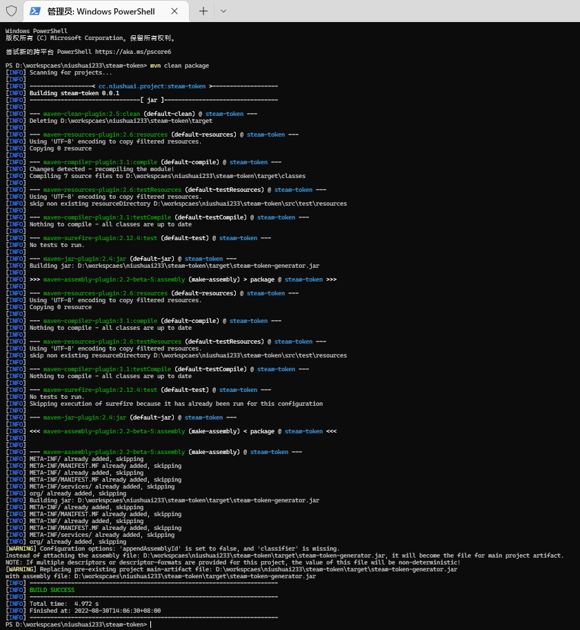
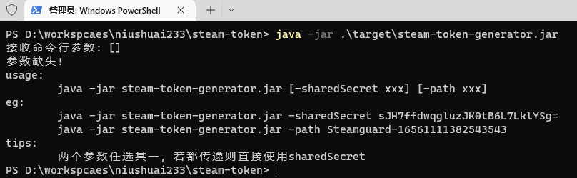
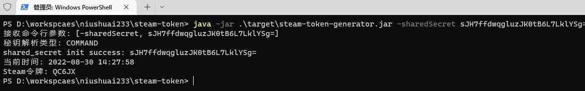
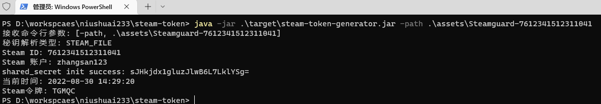

# steam-token
steam令牌本地获取-java版本


### 介绍

本项目目的是为了解决在执行steam登陆操作时需要打开手机app查看steam令牌问题

毕竟我在玩电脑的时候是不想摸手机的qvq


### 效果展示


### 前置条件

- 账号需要绑定steam令牌
- 手机需要root(目的获取steam令牌文件)
- 未root时可以通过某种手段获取到steam令牌文件 （eg: 备份App)
- 前提条件自行解决，如果解决不了，那么已经无法继续进行下去


### 构建

使用 `maven` 工具进行构建

```bash
cd 工程根目录
mvn clean package
```



### 获取令牌文件

在绑定了steam令牌后，手机app查看目录

```bash
/data/data/com.valvesoftware.android.steam.community/files/Steamguard-(这一串数字是steamid)
```

文件内容：

```json
{
    "shared_secret": "sJHkjdx1gluzJlwB6L7LklYSg=",
    "serial_number": "9343661234462106438",
    "revocation_code": "Z14513",
    "uri": "otpauth:\/\/totp\/Steam:zhangsan123?secret=W123Wfds1123fdsH123JI&issuer=Steam",
    "server_time": "1613782664",
    "account_name": "zhangsan123",
    "token_gid": "25e5x55f001449ee",
    "identity_secret": "HY8\/eDpZYcrasdvfewtkyweEfs=",
    "secret_1": "Qywu12fY9L7Bt\/JVaOmQ123wr8=",
    "status": null,
    "steamguard_scheme": 2,
    "steamid": "7612341512311041"
}
```


此时有两种方式

1、直接使用当前文件

2、以文本形式打开该文件复制出 `shared_secret` 字段内容


### 运行



##### 1、使用shared_secret值

```bash
java -jar steam-token-generator.jar -sharedSecret sJH7ffdwqgluzJK0tB6L7LklYSg=
```



##### 2、读取令牌文件

```bash
java -jar .\target\steam-token-generator.jar -path .\assets\Steamguard-7612341512311041
```




### 展望

对于该工程代码是非常简单的，可以嵌入到其他项目使用

比如一个web服务，

```java
// 我提供了一个静态类入口供使用 只需要传入sharedSecret字段值即可
String steamGuardCode = SteamTwoFactorToken.generateSteamGuardCode(sharedSecret字段值);

// steamGuardCode即为获取到的令牌值
System.out.println(steamGuardCode);
```

这样你就可以打开网页就可以看到你的令牌，也不需要执行什么命令

当然，为了防止其他人访问到，可以加个密码之类的，这个就任由扩展了，该项目只是为了拿到令牌值，并不对之后的内容负责。


### Tips

1. 运行方式二选一即可，shared_secret字段值优先
2. 运行时需要将参数替换为各自的内容
3. assets文件内提供的steam令牌文件仅为示例文件


